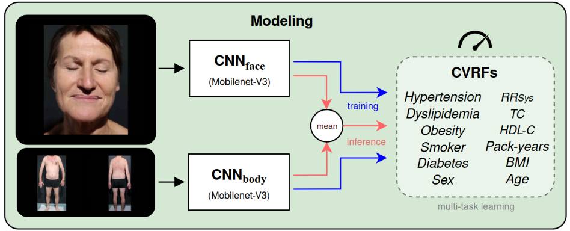

# DEep Learning PHotography Inferred Risk Factors (DELPHI-RF)

This repository contains the official code for multitask learning from facial and full body photographs, as described in the paper

*Screening for Cardiovascular Risk Factors Using Total Body Photographs and Deep Learning in the General Population: A Training and Validation Study*

The repository contains code for preprocessing, nested k-fold training and inference.



## Requirements
### Hardware requirements
The algorithm was developed and tested on Ubuntu 22.04 and Windows 10.
A standard computer with enough RAM is required for inference. 
For training, a GPU with > 10 GB VRAM is recommended. The algorithm was developed on a A6000 GPU. 
Inference can also run on CPU; for that please set the device in `src/config.py` to cpu.

### Software requirements
The code was developed with following package versions:
- Pytorch
- mediapipe
- opencv-python

## Running DELPHI-RF
The file main.py is used to run the model with different arguments.
1. `python main.py train` -> initiate training
2. `python main.py test` -> run inference and save predictions
3. `python main.py ext` -> run inference and save predictions on a different pc. You probably won't need this.
4. `python main.py trace` -> save light version of model for potential deployment
5. `python main.py face` -> run face-drop analysis

### Preprocessing

If you wish to run our preprocessing pipeline on your images, please refer to `notebooks/Pipeline-HCHS-Preprocessing.ipynb`.
The pipeline requires a folder with subfolders for each subject, containing the unsorted images:

    ├── INPUT_FOLDER                
        ├── subject_1
        │ └── image1
        │ └── ... 
        └── subject_2 
          └── ... 
          
The pipeline will produce a new folder containing subfolders with a face/front/back for each subject:

    ├── OUTPUT_FOLDER                
        ├── subject_1
        │ └── face
        │ └── front 
        │ └── back 
        └── subject_2 
          └── face
          └── front 
          └── back 

Please find more information in the notebook.


### Training on your own data
A training dataframe in the following format is required.
   ```sh
           base_dir           face        front        back         face_locs                      SEX      AGE    
      1    pathTo/Subject1/   face.png    front.png    back.png     pathTo/Subject1_facelocs.npy   0        47       
      2    pathTo/Subject2/   face.png    front.png    back.png     pathTo/Subject2_facelocs.npy   0        32
      3    pathTo/Subject3/   face.png    front.png    back.png     pathTo/Subject3_facelocs.npy   1        50
   ```
To create such a dataframe, please refer to the preprocessing notebook, where you can also find the generation of face-locs.
Best practice is to establish a function that returns the dataframe in the appropriate format (see the HCHS-dataset specific function `create_hchs_dataframe` in `dataframe.py`). Please also define the target columns and whether the target is a regression task or binary classification in `define_targets` in `dataframe.py`. Multiclass classification is currently not supported. Configure training in `config.py` by specifying a path where weights shall be stored. Initiate training with `python main.py train`. The training process will initiate training of two models: face and body. Weights will be saved for each modality (face or body), each fold and each subfold.


### Inference
To run inference, call `python main.py test`. The function will load the weights, and generate out-of-fold predictions for face and body. The predictions will be stored in the weights folder, which can be used for further analysis.
